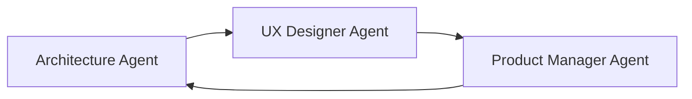
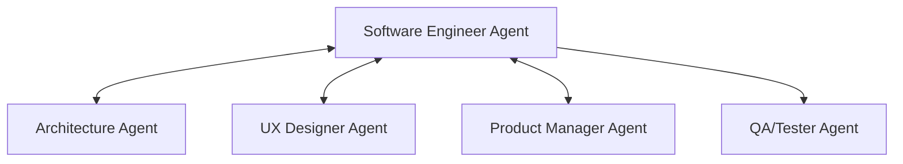
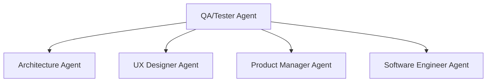

# Multi-Agent Coordination Structure for Lens AI

## Overview
This document outlines the coordination structure for developing the Lens AI mobile app using specialized AI agents for different aspects of the project.

## Agent Team Structure

### 🏗️ **1. Architecture Agent**
**Role:** System Design & Technical Architecture
**Responsibilities:**
- Overall system architecture design
- Service layer organization and dependencies
- Data flow and state management design
- Performance optimization strategies
- Security architecture and best practices
- Integration patterns between components

**Key Deliverables:**
- Architecture diagrams and documentation
- Service interface definitions
- Data models and schemas
- Performance benchmarks and requirements
- Security requirements and patterns

### 🎨 **2. UX Designer Agent**  
**Role:** User Experience & Interface Design
**Responsibilities:**
- User journey mapping and flow design
- Mobile UI/UX patterns and best practices
- Accessibility and usability standards
- Visual design system and components
- User interaction patterns and micro-interactions
- Photography workflow optimization

**Key Deliverables:**
- User flow diagrams and wireframes
- UI component specifications
- Design system guidelines
- Accessibility requirements
- User interaction specifications

### 📋 **3. Product Manager Agent**
**Role:** Feature Planning & Requirements
**Responsibilities:**
- Feature prioritization and roadmap planning
- User story creation and acceptance criteria
- Business logic requirements definition
- Feature scope and MVP definition
- Cross-feature integration requirements
- User feedback integration and iteration planning

**Key Deliverables:**
- Feature specifications and user stories
- Acceptance criteria and test scenarios
- Priority matrix and roadmap
- Integration requirements between features
- Success metrics and KPIs

### 💻 **4. Software Engineer Agent**
**Role:** Code Implementation & Development
**Responsibilities:**
- Flutter/Dart code implementation
- Service layer development
- API integration and data persistence
- Performance optimization implementation
- Code quality and best practices
- Local-first architecture implementation

**Key Deliverables:**
- Production-ready Flutter code
- Service implementations
- Unit tests and integration tests
- Code documentation and comments
- Performance-optimized implementations

### 🧪 **5. QA/Tester Agent**
**Role:** Quality Assurance & Testing
**Responsibilities:**
- Test strategy and test plan development
- Automated testing implementation
- Manual testing and edge case identification
- Performance testing and benchmarking
- Security testing and vulnerability assessment
- User acceptance testing coordination

**Key Deliverables:**
- Comprehensive test plans and test cases
- Automated test suites
- Bug reports and quality metrics
- Performance test results
- Security assessment reports

## Coordination Workflow

### **Phase 1: Planning & Design (Architecture → UX → Product Manager)**


**Workflow:**
1. **Architecture Agent** defines system architecture and technical constraints
2. **UX Designer Agent** creates user flows within technical constraints
3. **Product Manager Agent** validates features against business requirements
4. **Iteration** until alignment is achieved

### **Phase 2: Development (Software Engineer ↔ All Agents)**


**Workflow:**
1. **Software Engineer Agent** implements features based on specifications
2. **Continuous feedback** with Architecture, UX, and Product agents
3. **QA/Tester Agent** validates implementations
4. **Iteration** based on testing feedback

### **Phase 3: Quality & Refinement (QA → All Agents)**


**Workflow:**
1. **QA/Tester Agent** identifies issues and improvement opportunities
2. **Each agent** addresses feedback in their domain
3. **Integration testing** and validation
4. **Final review** and approval

## Communication Protocols

### **Standard Communication Format:**
```
FROM: [Agent Role]
TO: [Target Agent(s)]
TYPE: [Request/Response/Update/Review]
PRIORITY: [High/Medium/Low]
DEPENDENCIES: [What this blocks/enables]

CONTEXT: [Background information]
REQUEST/UPDATE: [Specific ask or information]
DELIVERABLES: [Expected outputs]
TIMELINE: [When needed]
```

### **Decision Making Protocol:**
1. **Technical Decisions** → Architecture Agent leads, others provide input
2. **UX Decisions** → UX Designer Agent leads, others provide constraints
3. **Feature Decisions** → Product Manager Agent leads, others provide feasibility
4. **Implementation Decisions** → Software Engineer Agent leads, others review
5. **Quality Decisions** → QA/Tester Agent leads, others provide context

## Task Delegation Framework

### **Feature Development Workflow:**

#### **Step 1: Feature Specification**
- **Product Manager Agent** creates user stories and acceptance criteria
- **Architecture Agent** reviews technical feasibility
- **UX Designer Agent** creates user flows and wireframes
- **QA/Tester Agent** defines test scenarios

#### **Step 2: Technical Design**
- **Architecture Agent** designs service architecture
- **UX Designer Agent** creates detailed UI specifications
- **Software Engineer Agent** reviews implementation approach
- **QA/Tester Agent** plans testing strategy

#### **Step 3: Implementation**
- **Software Engineer Agent** implements the feature
- **Architecture Agent** reviews code architecture
- **UX Designer Agent** reviews UI implementation
- **Product Manager Agent** validates feature behavior

#### **Step 4: Quality Assurance**
- **QA/Tester Agent** executes test plans
- **All Agents** review and address feedback
- **Product Manager Agent** approves final implementation

## Current Project Context

### **Project Status:**
- ✅ **Architecture Foundation** - Local-first mobile app with optional sync
- ✅ **Cleanup Complete** - Removed AWS dependencies and network complexity
- 🔄 **Current Focus** - Preset system simplification and feature refinement
- ⏳ **Next Phase** - Complete core feature implementation

### **Immediate Priorities:**
1. **Preset System Redesign** - Simplify overly complex preset functionality
2. **AI Integration Completion** - Finish AI response parsing and camera settings
3. **Camera Control Enhancement** - Improve mobile camera provider capabilities
4. **UI/UX Polish** - Refine user interface and photography workflow
5. **Testing & Validation** - Comprehensive testing of core functionality

## Agent Interaction Examples

### **Example 1: Preset System Simplification**

**Product Manager Agent** → **Architecture Agent**:
```
FROM: Product Manager
TO: Architecture Agent
TYPE: Request
PRIORITY: High

CONTEXT: Current preset system is over-engineered with ratings, metadata, and network dependencies that don't align with local-first architecture.

REQUEST: Design simplified preset architecture that supports:
- 5-6 built-in presets (Portrait, Landscape, etc.)
- 3-5 user-created presets
- Local storage only
- Mobile camera setting limitations

DELIVERABLES: Simplified data models and service architecture
TIMELINE: Next planning session
```

**Architecture Agent** → **UX Designer Agent**:
```
FROM: Architecture Agent  
TO: UX Designer Agent
TYPE: Update
PRIORITY: High

CONTEXT: Simplified preset architecture removes complex rating/social features

UPDATE: New preset constraints:
- Maximum 11 total presets (6 built-in + 5 user)
- Settings limited to: WB, exposure compensation, focus mode, scene mode
- No ratings, statistics, or social features
- One-tap apply, simple save/delete for user presets

REQUEST: Design preset UI that works within these constraints
DELIVERABLES: Preset selection UI, preset creation flow
```

### **Example 2: AI Response Integration**

**Software Engineer Agent** → **QA/Tester Agent**:
```
FROM: Software Engineer
TO: QA/Tester Agent  
TYPE: Request
PRIORITY: Medium

CONTEXT: Implemented AI response parsing service that extracts camera settings from AI backend responses and applies them to camera.

REQUEST: Need comprehensive testing of:
- AI response parsing accuracy
- Camera settings application
- Error handling for malformed responses
- Performance with different response sizes

DELIVERABLES: Test results and identified edge cases
TIMELINE: Before next integration milestone
```

## Success Metrics

### **Coordination Effectiveness:**
- **Communication Clarity** - All agents understand requirements and constraints
- **Dependency Management** - No blocking issues between agents
- **Quality Outcomes** - Features meet all agent requirements (technical, UX, product, quality)
- **Iteration Efficiency** - Fast feedback loops and quick issue resolution

### **Project Success:**
- **Architecture Quality** - Clean, maintainable, performant code
- **User Experience** - Intuitive, efficient photography workflow  
- **Feature Completeness** - All core features working as specified
- **Quality Standards** - Comprehensive testing and bug-free operation
- **Timeline Adherence** - Milestones met with quality deliverables

## Getting Started

### **Immediate Next Steps:**
1. **All Agents Review Current State** - Understand existing codebase and recent cleanup
2. **Priority Assessment** - Agree on immediate focus areas
3. **Task Assignment** - Each agent takes ownership of their domain priorities
4. **Communication Setup** - Establish regular check-ins and update protocols
5. **First Sprint Planning** - Define first set of coordinated deliverables

This multi-agent structure ensures comprehensive coverage of all project aspects while maintaining clear ownership and accountability for each domain.